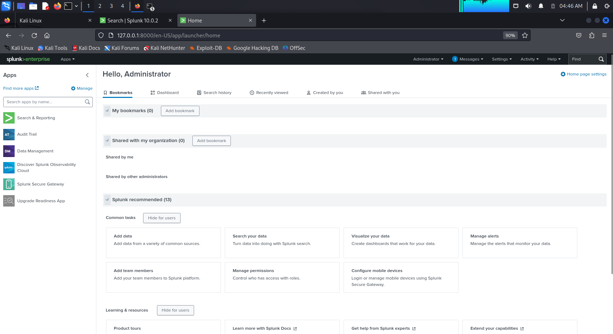
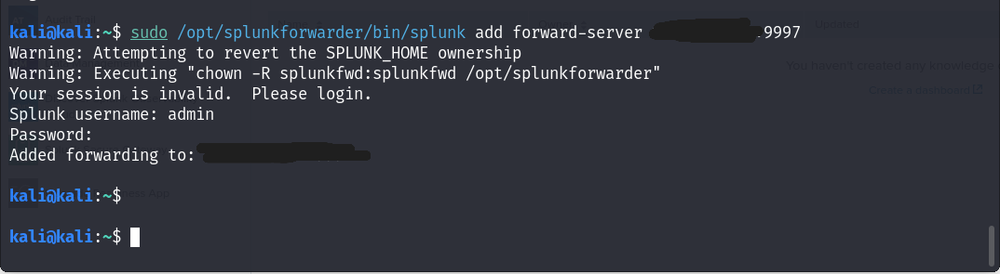
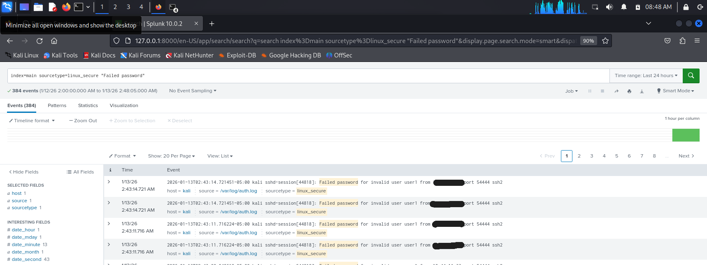
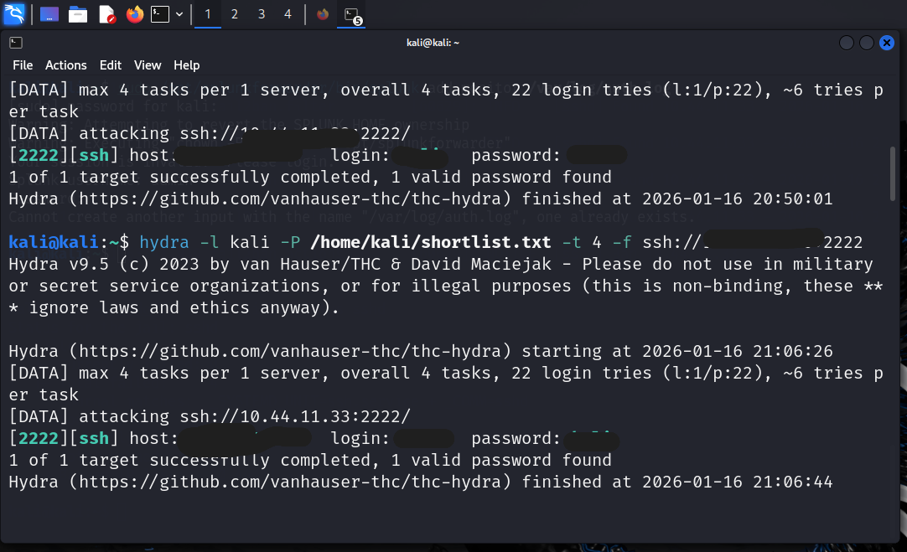
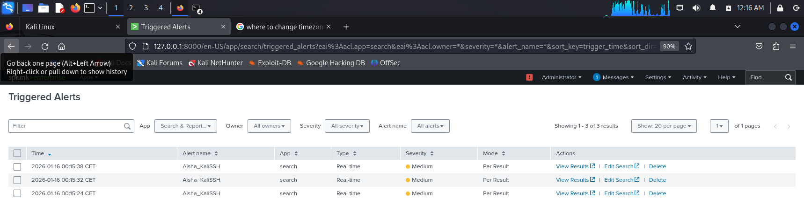
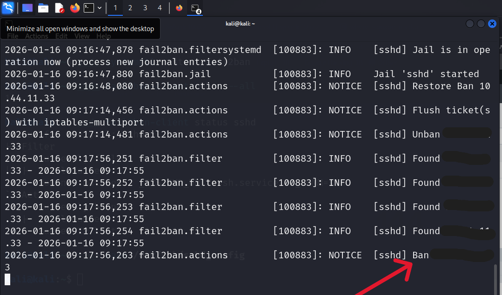

From Logs to Alerts: Building an SSH Brute-Force Detection System with Splunk  
 
Project Type: Brute Force Attack · SOC Fundamentals  
Tools: Kali, Hydra, Splunk, Splunk Forwarder  
Date: January 18, 2026  

                        Analyst: Aisha B. Bello  

Confidentiality Notice: 

This project is a simulation of a Brute Force Attack on Virtual Machine to achieve a real-world SOC investigation scenario. All precautions were taken to execute this project and findings are based on controlled lab data and used strictly for educational and portfolio purposes.  

 
Project Overview  
 
This project demonstrates the end‑to‑end deployment of a Security Information and Event Management (SIEM) solution using Splunk Enterprise to detect SSH brute‑force attacks in a Linux environment. The lab covers the installation and configuration of Splunk Enterprise and the Splunk Universal Forwarder, forwarding authentication logs from a Kali Linux system, simulating brute‑force login attempts using Hydra, and creating a real‑time alert to identify malicious behavior. Mitigation techniques were applied using Fail2Ban, firewall rules, and SSH hardening.  

The objective is to replicate a real SOC workflow: log ingestion → detection → alerting → response → verification.  

Tools and Requirements  

Software Tools  

Splunk Enterprise — SIEM platform for log ingestion, search, correlation, and alerting.  
Splunk Universal Forwarder — Forwards authentication logs to Splunk Enterprise.  
Kali Linux — Acts as both the victim system and attack simulation environment.  
Hydra — Used to simulate SSH brute‑force attacks.  
Rsyslog — Generates and manages authentication logs (auth.log).  
OpenSSH Server — Provides the SSH service.  

System Requirements  

Virtualization platform (VMware or VirtualBox)  
At least 2 GB RAM allocated to each VM  
Open TCP ports:  
8000 — Splunk Web Interface  
9997 — Splunk receiving port  
22 / custom SSH port — SSH service  

 
STEP 1: Installation of Splunk Enterprise on Kali  

1. Using the Kali browser, navigate to www.splunk.com, log in, and download Splunk Enterprise for Linux (.deb).  
2. Open a terminal and navigate to the Downloads directory:  
 
            cd Downloads 
            ls
3. Install Splunk: Run the script  

            sudo dpkg -i splunk-10.0.0-e8eb0c4654f8-linux-amd64.deb
4. Change to the Splunk binary directory:  

            cd /opt/splunk/bin
5. Start Splunk:  

            sudo ./splunk start
6. Accept the license agreement when prompted and create Username and password  

7. Copy the displayed IP address and port (default 8000). Login with credentials created during startup and Confirm that the Splunk Enterprise Dashboard loads successfully  

            http://127.0.0.1:8000
    
Splunk Web login page and dashboard after first login. 

STEP 2: Installion and Configuration of Splunk Universal Forwarder  

Splunk Universal Forwarder is installed and configureed to send Linux authentication logs to Splunk instance.  

Log in to splunk.com and download the Splunk Universal Forwarder (.deb) or copy the wget link into Kali.  
Verify the downloaded file size (30–50 MB):  

            ls -lh splunkforwarder-10.0.2-e2d18b4767e9-linux-amd64.deb
3. Install the forwarder:  

            sudo dpkg -i splunkforwarder-10.0.2-e2d18b4767e9-linux-amd64.deb
4. Start the forwarder and accept the license and create Username and password  

            sudo /opt/splunkforwarder/bin/splunk start --accept-license
5. Point the forwarder to the Splunk server: The IP required in the stage is the IP address of the Victim machine.  

            sudo /opt/splunkforwarder/bin/splunk add forward-server 192.168.123.20:9997
6. Add monitoring for authentication logs: This command instructs the Splunk Universal Forwarder to monitor the system’s authentication log file in real time and store them in /var/log/auth.log  

            sudo /opt/splunkforwarder/bin/splunk add monitor /var/log/auth.log
    
Successful forwarder connection and monitor addition output
Permissions and Log Availability Fixes  

7. Fix ownership permissions: This changes ownership of the Splunk Forwarder files from root to the kali user (your victim machine). It is important to do this because Splunk Forwarder needs write access to its own directories  

            sudo chown -R kali:kali /opt/splunkforwarder ls -l /opt/splunkforwarder
8. Install and enable rsyslog: The version of kali used in this project does not have the /var/log/auth.log.The rsyslog is installed for this purpose  

            sudo apt update && sudo apt install rsyslog -y 
            sudo systemctl start rsyslog 
            sudo systemctl enable rsyslog
9. Verify auth.log exists and Update permissions its permission  

            ls -l /var/log/auth.log
            sudo chmod 644 /var/log/auth.log
10. Re-add the log monitor:  

            sudo /opt/splunkforwarder/bin/splunk add monitor /var/log/auth.log

Forwarder Password Enforcement Fix  
11. Restart the forwarder:  

            sudo /opt/splunkforwarder/bin/splunk start --accept-license --answer-yes
12. If password enforcement error appears, stop the forwarder and remove the password file:  

            sudo /opt/splunkforwarder/bin/splunk stop
            sudo rm /opt/splunkforwarder/etc/passwd
13. Edit user-seed configuration and save.  

            sudo nano /opt/splunkforwarder/etc/system/local/user-seed.conf
            [user_info]
            USERNAME = admin
            PASSWORD = Password!

14. Restart the forwarder and re-link it to Splunk using the new credentials.  
        
Forwarder successfully connected in Splunk UI

STEP 3: Simulating an SSH Brute Force Attack  
Generate failed and successful SSH login events for detection testing.  

Install and run Hydra with a custom wordlist: 

            hydra -l kali -P /home/kali/shortlist.txt ssh://<VICTIM_IP>:<PORT>
2. Allow SSH traffic:  

            sudo ufw allow ssh
3. Execute brute force with limited threads.  

            hydra -l kali -P /home/kali/shortlist.txt -t 4 -f ssh://<VICTIM_IP>:
4. Search Splunk for authentication logs:  

            index=main sourcetype=linux_secure ("Failed password" OR "Accepted password")
          
Hydra attack output and corresponding Splunk log entries.   

STEP 4: Creating a Brute Force Detection Alert  
Detection of multiple failed SSH login attempts and trigger a real-time alert.  

Verify failed login events: 

            index=* "Failed password"
2. Generate multiple failed SSH attempts manually and Use this detection SPL query for alerts generated. Save as Alert (Real-Time) and configure trigger conditions.  

            index=main sourcetype=linux_secure "Failed password" | rex "from (?<src_ip>\d+\.\d+\.\d+\.\d+)" | stats count AS failed_attempts by src_ip | where failed_attempts >= 3

3. Re-run brute force attempts to trigger the alert.  
        
Alert configuration page and triggered alert in Splunk.

STEP 5: Mitigation and Defensive Controls  
 
The success of a brute force attack may be an indication of a weak password policy implemented or misconfigurations of mitigation rule. Therefore, it is important to implement host-based controls to stop the attacker and validate the effectiveness of the mitigation controls.  

Hardening and Blocking  
 
Generate SSH keys: It is important to generate this key as it is an important security practice for mitigation. This replacing password-based authentication with a more secure, cryptographic method and nearly impossible for attackers to crack this mathematically complex key  

            ssh-keygen

2. Harden SSH configuration (/etc/ssh/sshd_config):  

            Enable public key authentication
            Disable password authentication
            Disable root login

3. Block attacker IP:  

            sudo iptables -A INPUT -s 10.44.11.33 -j DROP

4. Configure Fail2Ban: This configuration is crucial because it automatically detects and blocks malicious IP addresses attempting repeated failed logins and reducing server’s attack surface  

            sudo nano /etc/fail2ban/jail.local

            maxretry = 2
            findtime = 3600
            bantime = 600
            ignoreself = false
            Restart Fail2Ban:

            sudo systemctl restart fail2ban

5. Monitor Fail2Ban logs:  

            sudo tail -f /var/log/fail2ban.log

    
Fail2Ban ban event in terminal.  
6. Add Fail2Ban logs to Splunk:  

            sudo /opt/splunkforwarder/bin/splunk add monitor /var/log/fail2ban.log -index main -sourcetype fail2ban
7. Run mitigation SPL query:  

            index=main sourcetype=fail2ban "Ban" | rex "\[(?<jail>\w+)\] Ban (?<banned_ip>\d+\.\d+\.\d+\.\d+)" | stats count by banned_ip, jail | rename banned_ip as "Neutralized Attacker", jail as "Protocol", count as "Attempts Blocked"

    
Splunk dashboard showing banned IPs and blocked attempts.  

Why This Project Matters  
 
This project reflects a real-world SOC workflow, making it highly relevant to defensive security operations. It demonstrates end-to-end incident handling and reduces dwell time when real-time alerts for brute-force activity are configured properly. SSH brute-force attacks are among the most frequent threats against systems, making this detection use case highly practical.  

Key Takeaways  
Logs tell the full attack story when analyzed properly.  
Detection without context is incomplete.  
Real-time alerting is critical to enables security teams to respond to attacks.  
Detection alone is not enough but implementing preventive strategies closes the loop between visibility and response.  
Dashboards enhance situational awareness SOC analysts during active incidents.  
 
Conclusion  
Between the initial setup and the final mitigation phase, our Splunk-based lab successfully detected and responded to coordinated SSH brute-force activity on the victim machine.  

By:  

Installing and configuring Splunk Enterprise and Universal Forwarder  
Ingesting and monitoring Linux authentication logs (auth.log)  
Simulating SSH brute-force attacks using Hydra  
Building real-time alerts to detect repeated failed logins  
Implementing mitigation through Fail2Ban, firewall rules, and SSH hardening  
Visualizing results via Dashboards and reports  

We transformed raw log data into actionable security intelligence, demonstrating a full SOC workflow from detection to response.  

True SOC defense is not just alert response, but designing systems that detects and prevents compromise.  
