**Comprehensive Static and Dynamic Analysis of an Incransom Ransomware Sample: Behavior, Persistence, and Threat Intelligence **

 
Project Type: Malware Analysis · SOC Fundamentals 
Tools: FlareVM, INetSim 
Date: December 25, 2025 
 
 
Analyst: Aisha Bello 

**Confidentiality Notice:**

This project is a simulation of a Static and Dynamic Malware Analysis as part of a SOC investigation scenario. All precausions were taken to execute this project. The findings of this project are based on controlled lab data and are used strictly for educational and portfolio purposes. 
    

**Executive Summary** 

Modern ransomware campaigns continue to evolve, adopting stealthier execution methods and abusing legitimate system components to evade detection. This ransomware has been operating since July, 2023, with a focus on targeting healthcare, education and technology sectors. This malware analysis documents a comprehensive static and dynamic analysis of a Windows-based ransomware sample identified as Incransom — a sophisticated malware that encrypts user data affecting the core cybersecurity CIA triad. What makes this ransomware dangerous is its ability to use Living-off-The-Land techniques and double extortion. 

**Key Findings from Malware Investigation:** 
•	**Malware Family**: INC Ransomware (Ransoware) 
•	**Primary Target:** User-data encryption and extortion 
•	**Evasion Techniques**: Process masquerading 
•	**Persistence: Modified** Startup registry key 

**Malware Sample Acquisition** 

The malware sample was obtained from MalwareBazaar, a reputable malware repository to ensure authenticity and research relevance. The sample was downloaded as a zip file, with its known hash value to avoid accidental acquisition of an incorrect or modified file. 

**STATIC ANALYSIS OF INCRANSOM RANSOMWARE** 
The malware embedded in the zip file was extracted for static malware analysis (windows.exe) 
1. **Malware Information** 
The windows.exe file was examined to determine its hash, format and operating system compatibility using tools Powershell, HxD and HashCalc 
**Findings**: 
•	**Hash SHA256:** 834C5F094C4A2DB0F520962341B108AF685EFD346E5B6622EB2331B3FFA09039 
•	**File Header**: MZ_ 4D 5A 
•	**File type**: windows.exe, Portable Executable — PE32 
•**Architecture**: Intel 80386 
•	**Subsystem:** Console 
    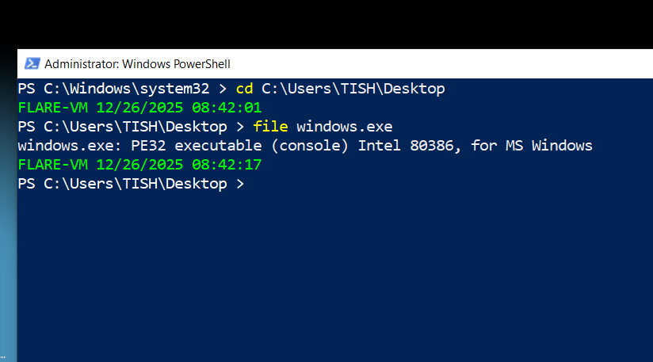
    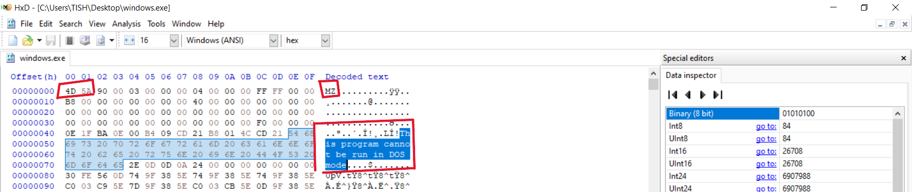

2. **Entropy & Packing Analysis** 
Entropy analysis using PEStudio and Detect It Easy (DIE) revealed: 
•	**Entropy Score**: 6.712 
•	**Packing Level**: ~83% 
•	**Packed Section:** .text 

The presence of **crypt32.dll** suggests the malware leverages Windows cryptographic APIs for encryption routines. While not fully obfuscated, the packing indicates deliberate attempts to hinder static analysis. 
    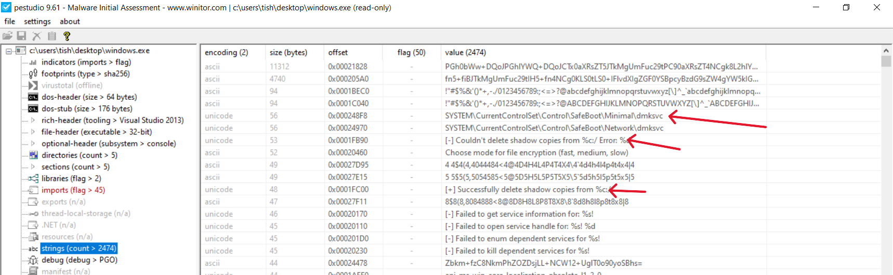

3. **String analysis (PE studio and Floss)** 
**Key observations include**: 
•	References to Safe Boot modification and shadow copy deletion, indicating ransomware persistence mechanisms. 
•	Abuse of legitimate Windows libraries: 
**CRYPT32.dll** — encryption and cryptographic operations 
**MPR.dll** — network share enumeration and access 
•	**FLOSS**-extracted strings revealed command-line arguments consistent with ransomware execution logic. 
    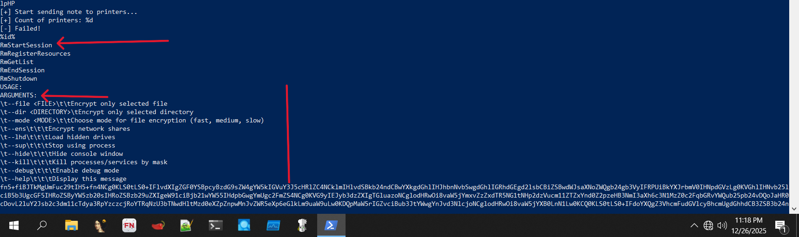
    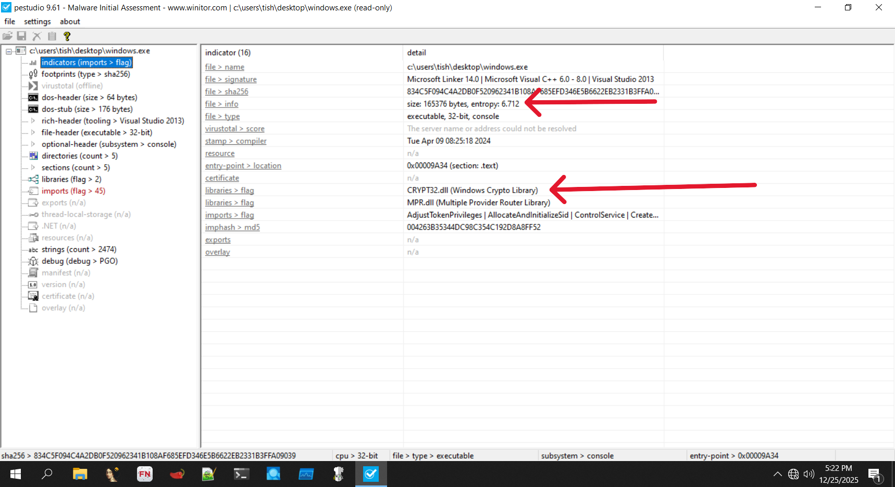
    

**Threat Intelligence Correlation (VirusTotal)** 

Malware Hash: SHA256- 834c5f094c4a2db0f520962341b108af685efd346e5b6622eb2331b3ffa09039 

1. Detection Ratio: A total of 64/72 security vendors flagged this malware as malicious with a 90% Anti-Virus detection rate.
    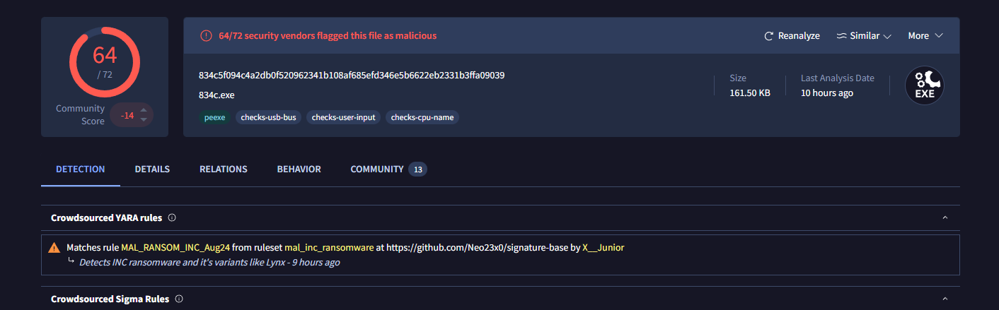

2. Identification of Hash and Metadata 
•	Hash: SHA-256: 834C5F094C4A2DB0F520962341B108AF685EFD346E5B6622EB2331B3FFA09039 
•	File Type: Windows Portable Executable (PE32) 
•	File Names: windows.exe , 834c.exe , 834c5f094c4a2db0f520962341b108af685efd346e5b6622eb2331b3ffa09039.exe 
•	Architecture: Intel 80386 
•	Subsystem: Console 
•	Magic Bytes: 4D 5A (MZ) 
•	Family labels: incransom; imps: raninc 
•	File Size: 161.50 KB (165376 bytes) 
•	Date of Creation: The malware was first created in 2024–04–09 

3. Behavioral Indicators 
Execution Context 
The malware was delivered as ZIP archive named WINDOWS.ZIP, a common social engineering tactic used to disguise malicious content as legitimate system files. Once extracted and executed, the malware initiated its infection chain. 

Detection Summary: 
•	Detection rate: 56/67 engines 
•	Execution context: User-assisted execution via compressed archive 
•	Behavioral tags:checks-cpu-name , checks-usb-bus , checks-user-input , crypto 
These behaviors indicate environmental awareness, often used to evade sandboxes and automated analysis systems. 

4. Network Behavior Analysis 
Outbound Communications.  
The malware initiated outbound HTTP requests using the Microsoft-CryptoAPI/6.1 user-agent, a tactic used to masquerade malicious traffic as legitimate system communication. 

Contacted Domains 
•	crt.sectigo.com 
•	sectigo.com 
•	microsoft.com 
•	www.microsoft.com 
Although some of these domains are legitimate, their use in this context is deceptive. The malware accessed certificate-related URLs to blend malicious traffic with trusted network flows.
    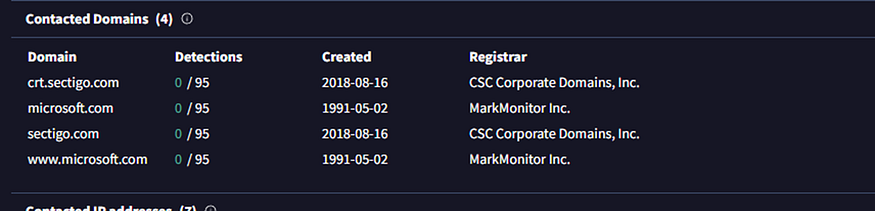

Contacted IP Addresses 
•	23.216.81.152 
•	20.99.133.109 
Both IPs are associated with U.S.-based infrastructure and were used to facilitate outbound communications.
    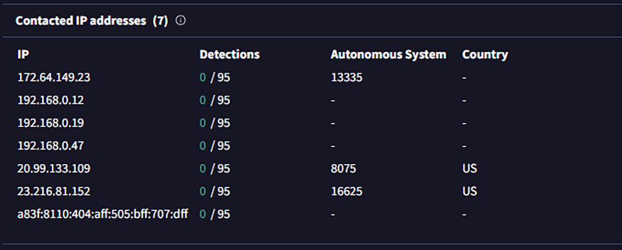

URL Patterns and Indicators 
All observed URLs followed a .crt structure and returned HTTP 200 responses, suggesting successful connections. These patterns strongly indicate: 
•	Command-and-control beaconing 
•	System fingerprinting 
•	Covert data exchange under the guise of certificate retrieval 
    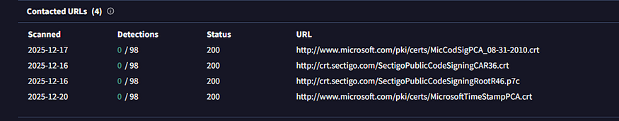

5. File System Activity 

5.1 File Creation and Modification 
The malware extensively interacted with the filesystem, creating and modifying files in sensitive directories. Notable behaviors include: 
•	Writing ransom-related files such as INC-README.html and INC-README.txt across root and system-level directories. 
•	Accessing and modifying files within: 
•	C:\$Recycle.Bin\ 
•	C:\MSOCache\All Users\ 
These actions suggest deliberate attempts to blend malicious artifacts into trusted system locations while preparing ransom notifications. 
    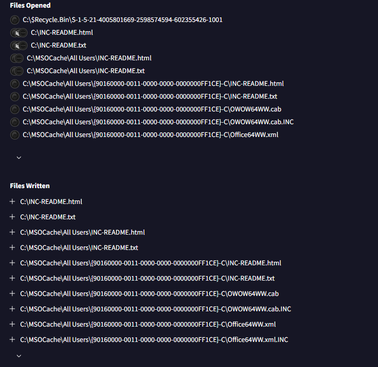

6. Registry Activity 

The malware accessed several registry locations, particularly: 
HKCU\Software\Microsoft\Windows\CurrentVersion\Explorer 
HKCU\Software\Microsoft\Windows\CurrentVersion\Explorer\User Shell Folders 

These keys reveal user directory structures and allow the malware to identify high-value locations such as Desktop, Documents, and AppData. This behavior strongly supports reconnaissance and persistence preparation. 
    

7. Process and Execution Behavior 

7.1 Process Creation 
Key processes involved include: 
•	software.exe – This is the initial dropper placed on the user’s Desktop which was used to manually launched the file, and trigger the ransomware infection. 
•	%SAMPLEPATH%\834c5f094c4...exe – This is the main ransomware payload, stored in a temporary directory. 
•	FXSSVC.exe – Abused to blend malicious activity 
•	conhost.exe – Forced execution to suppress console logging 
    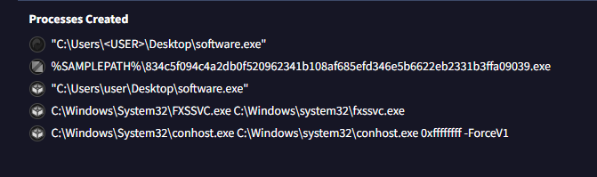

