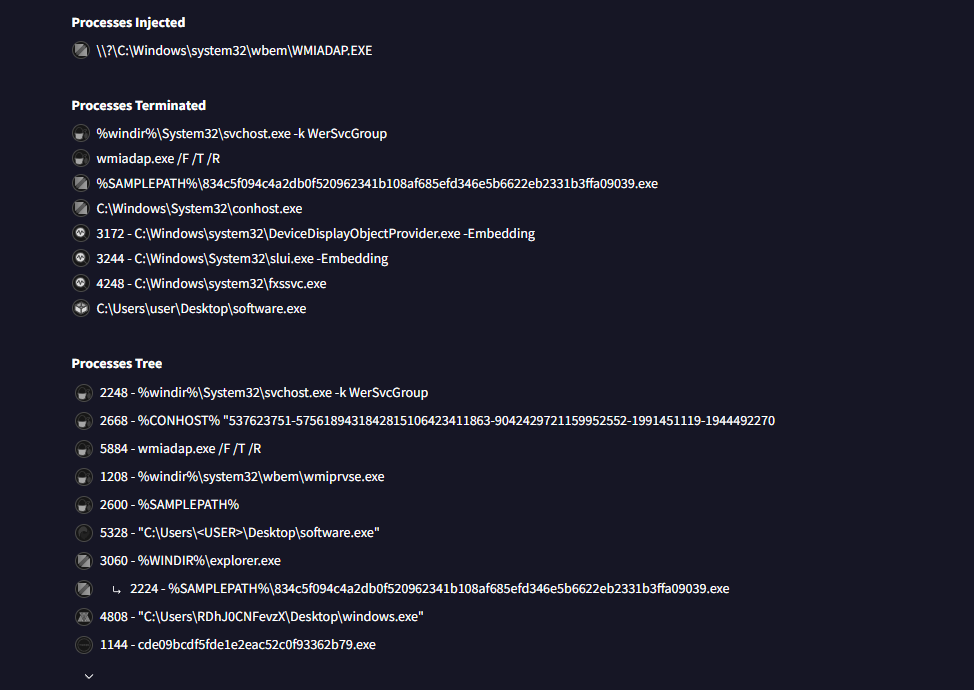
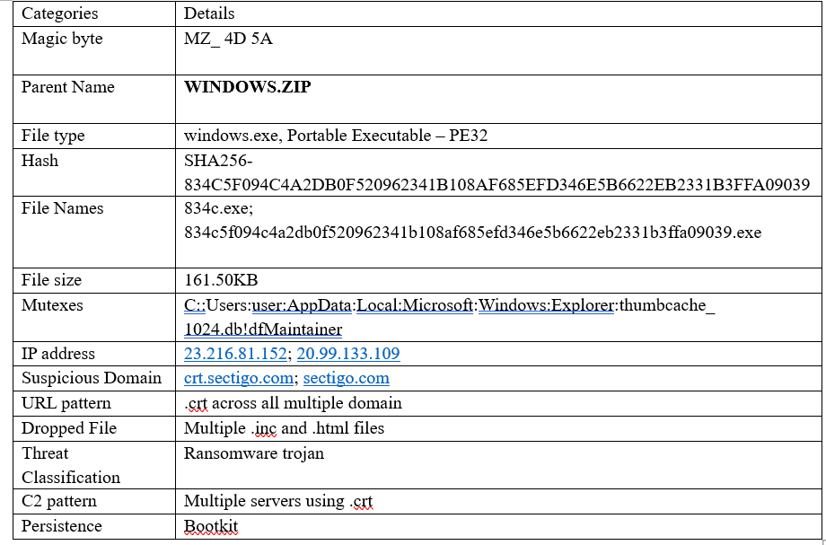
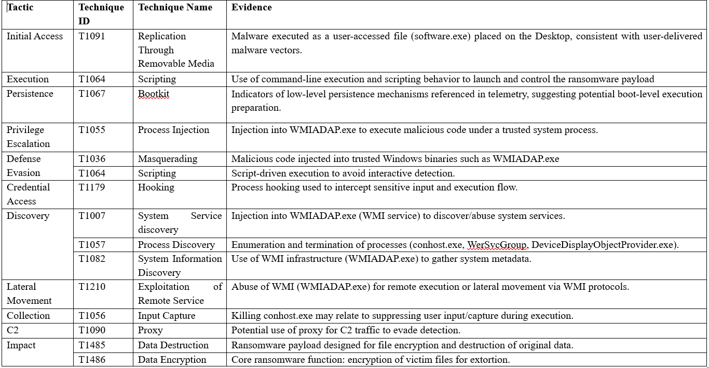
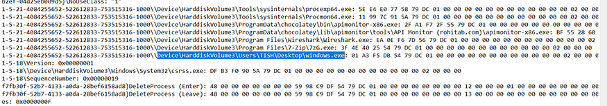
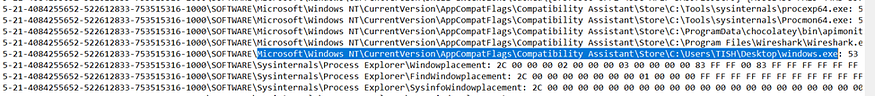
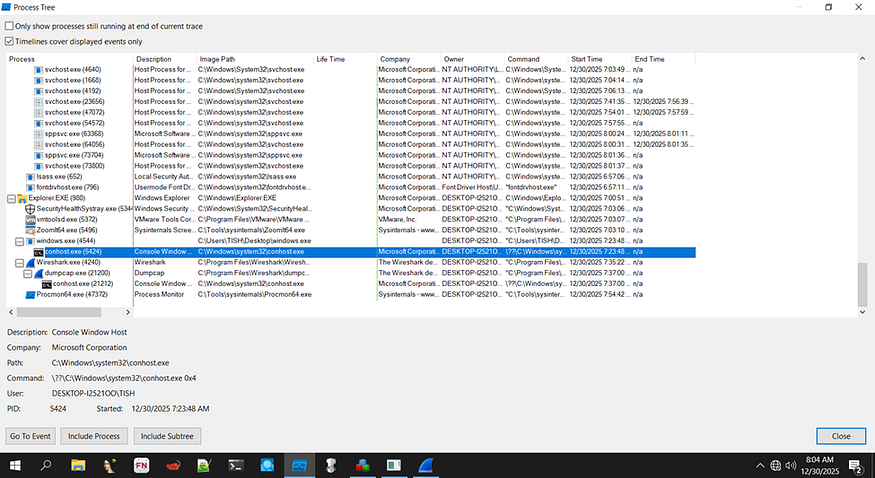

**Comprehensive Static and Dynamic Analysis of an Incransom Ransomware Sample: Behavior, Persistence, and Threat Intelligence **

**Project Type**: Malware Analysis · SOC Fundamentals  
**Tools:** FlareVM, INetSim  
**Date**: December 25, 2025  

**Analyst**: Aisha B. Bello  

**Confidentiality Notice:**

This project is a simulation of a Static and Dynamic Malware Analysis as part of a SOC investigation scenario. All precausions were taken to execute this project. The findings of this project are based on controlled lab data and are used strictly for educational and portfolio purposes. 
    

**Executive Summary** 

Modern ransomware campaigns continue to evolve, adopting stealthier execution methods and abusing legitimate system components to evade detection. This ransomware has been operating since July, 2023, with a focus on targeting healthcare, education and technology sectors. This malware analysis documents a comprehensive static and dynamic analysis of a Windows-based ransomware sample identified as Incransom — a sophisticated malware that encrypts user data affecting the core cybersecurity CIA triad. What makes this ransomware dangerous is its ability to use Living-off-The-Land techniques and double extortion. 

**Key Findings from Malware Investigation**: 
•	**Malware Family**: INC Ransomware (Ransoware) 
•	**Primary Target:** User-data encryption and extortion 
•	**Evasion Techniques**: Process masquerading 
•	**Persistence: Modified** Startup registry key 

**Malware Sample Acquisition**  

The malware sample was obtained from MalwareBazaar, a reputable malware repository to ensure authenticity and research relevance. The sample was downloaded as a zip file, with its known hash value to avoid accidental acquisition of an incorrect or modified file. 

**STATIC ANALYSIS OF INCRANSOM RANSOMWARE**  
The malware embedded in the zip file was extracted for static malware analysis (windows.exe) 
1. **Malware Information**  
The windows.exe file was examined to determine its hash, format and operating system compatibility using tools Powershell, HxD and HashCalc  
**Findings**:  
•	**Hash SHA256:** 834C5F094C4A2DB0F520962341B108AF685EFD346E5B6622EB2331B3FFA09039 
•	**File Header**: MZ_ 4D 5A 
•	**File type**: windows.exe, Portable Executable — PE32 
•**Architecture**: Intel 80386 
•	**Subsystem:** Console 
    
    

**2.** **Entropy & Packing Analysis**  
Entropy analysis using PEStudio and Detect It Easy (DIE) revealed:  
•	**Entropy Score**: 6.712 
•	**Packing Level**: ~83% 
•	**Packed Section:** .text 

The presence of **crypt32.dll** suggests the malware leverages Windows cryptographic APIs for encryption routines. While not fully obfuscated, the packing indicates deliberate attempts to hinder static analysis. 
    

3. String analysis (PE studio and Floss) 
**Key observations include**: 
•	References to Safe Boot modification and shadow copy deletion, indicating ransomware persistence mechanisms. 
•	Abuse of legitimate Windows libraries: 
**CRYPT32.dll** — encryption and cryptographic operations 
**MPR.dll** — network share enumeration and access 
•	**FLOSS**-extracted strings revealed command-line arguments consistent with ransomware execution logic. 
    
    
    

**Threat Intelligence Correlation (VirusTotal)**  

**Malware Hash**: SHA256- 834c5f094c4a2db0f520962341b108af685efd346e5b6622eb2331b3ffa09039 

**1. Detection Ratio:** A total of 64/72 security vendors flagged this malware as malicious with a 90% Anti-Virus detection rate.
    

**2. Identification of Hash and Metadata**  
•	**Hash**: SHA-256: 834C5F094C4A2DB0F520962341B108AF685EFD346E5B6622EB2331B3FFA09039 
•	**File Type**: Windows Portable Executable (PE32) 
•	**File Names**: windows.exe , 834c.exe,834c5f094c4a2db0f520962341b108af685efd346e5b6622eb2331b3ffa09039.exe 
•	**Architecture**: Intel 80386  
•	**Subsystem:** Console  
•	**Magic Bytes**: 4D 5A (MZ) 
•	**Family labels**: incransom; imps: raninc  
•	**File Size**: 161.50 KB (165376 bytes)  
•	**Date of Creation**: The malware was first created in 2024–04–09  

**3. Behavioral Indicator**s  
**Execution Context**  
The malware was delivered as ZIP archive named WINDOWS.ZIP, a common social engineering tactic used to disguise malicious content as legitimate system files. Once extracted and executed, the malware initiated its infection chain. 

**Detection Summary**:  
•	**Detection rate**: 56/67 engines  
•	**Execution context**: User-assisted execution via compressed archive 
•	**Behavioral tags:**checks-cpu-name , checks-usb-bus , checks-user-input , crypto 
These behaviors indicate environmental awareness, often used to evade sandboxes and automated analysis systems. 

**4. Network Behavior Analysis**  
**Outbound Communications**.  
The malware initiated outbound HTTP requests using the Microsoft-CryptoAPI/6.1 user-agent, a tactic used to masquerade malicious traffic as legitimate system communication. 

**Contacted Domains**  
•	crt.sectigo.com 
•	sectigo.com 
•	microsoft.com 
•	www.microsoft.com 
Although some of these domains are legitimate, their use in this context is deceptive. The malware accessed certificate-related URLs to blend malicious traffic with trusted network flows.
    

**Contacted IP Addresses**  
•	23.216.81.152  
•	20.99.133.109  
Both IPs are associated with U.S.-based infrastructure and were used to facilitate outbound communications.
    

**URL Patterns and Indicators**  
All observed URLs followed a .crt structure and returned HTTP 200 responses, suggesting successful connections. These patterns strongly indicate:  
•	Command-and-control beaconing  
•	System fingerprinting< br>
•	Covert data exchange under the guise of certificate retrieval 
    

**5. File System Activity**  

**5.1 File Creation and Modification**  
The malware extensively interacted with the filesystem, creating and modifying files in sensitive directories. Notable behaviors include:  
•	Writing ransom-related files such as INC-README.html and INC-README.txt across root and system-level directories.  
•	Accessing and modifying files within:  
•	C:\$Recycle.Bin\  
•	C:\MSOCache\All Users\  
These actions suggest deliberate attempts to blend malicious artifacts into trusted system locations while preparing ransom notifications. 
    

**6. Registry Activity**  

The malware accessed several registry locations, particularly:  
**_HKCU\Software\Microsoft\Windows\CurrentVersion\Explorer_**  
**_HKCU\Software\Microsoft\Windows\CurrentVersion\Explorer\User_** Shell Folders  

These keys reveal user directory structures and allow the malware to identify high-value locations such as Desktop, Documents, and AppData. This behavior strongly supports reconnaissance and persistence preparation.  
    

**7. Process and Execution Behavior**  

**7.1 Process Creation**  
**Key processes involved include**:  
•	_**software.exe**_ – This is the initial dropper placed on the user’s Desktop which was used to manually launched the file, and trigger the ransomware infection.  
•	_**%SAMPLEPATH%\834c5f094c4...exe**_ – This is the main ransomware payload, stored in a temporary directory.  
•	**_FXSSVC.exe_** – Abused to blend malicious activity  
•	**_conhost.exe_** – Forced execution to suppress console logging  
    

**7.2 Process Injection**  

The malware injected code into WMIADAP.EXE, a trusted Windows Management Instrumentation process. This technique allows the malware to operate under a legitimate system process, significantly reducing detection likelihood.  

**7.3 Process Termination**  
To maintain control and avoid interference, the malware terminated several system processes, including:  
•	_**svchost.exe**_ – disabling error reporting  
•	_**wmiadap.exe**_ – enabling code injection  
•	_**conhost.exe**_ – hiding command-line execution  
•	_**sihost.exe**_ – suppressing UI refresh  
•	_**software.exe**_ – terminating the initial dropper post-execution  
This coordinated process manipulation highlights a mature ransomware design focused on stealth, persistence, and operational reliability. 
    

**INDICATORS OF COMPROMISE**  
    

**MITRE ATT&CK MAPPING**  
    

**Dynamic Analysis of Incransom Ransomware**  

To observe the real-time behavior of the Incransom ransomware, a dynamic analysis was conducted using Regshot and Process Monitor (Procmon). An initial system snapshot was taken before execution, followed by a second snapshot after running the malware with administrative privileges. This allowed for precise identification of system and registry modifications caused by the sample. 

**Registry Activity Analysis**  

The comparison revealed clear evidence of successful malware execution. Registry entries confirmed that the malicious binary (windows.exe) was executed directly from the user’s Desktop directory. 

Notably, artifacts were written under:  
_**HKLM\Software\Microsoft\Windows NT\CurrentVersion\AppCompatFlags\Compatibility Assistant\Store\C:\Users\TISH\Desktop\windows.exe**_  
This registry path is commonly used by Windows to track application execution history. Its presence confirms that the operating system recognized and logged the execution of the suspicious binary, validating successful compromise.  
    
    

**Process Activity and Execution Flow**  

Process Monitor analysis showed that the malicious executable (windows.exe) spawned conhost.exe, a legitimate Windows Console Host process. This behavior indicates that the malware leveraged command-line execution to perform its tasks, a common tactic used to evade user suspicion and security controls.  
The use of a misleading filename (windows.exe) further demonstrates a masquerading technique designed to trick users into believing the file is a legitimate system component. This parent–child relationship between windows.exe and conhost.exe provides high-confidence evidence of active malware execution and post-compromise activity.  
    

**Key Takeaways**  
•	Incransom is a highly capable ransomware variant that combines encryption, persistence, and stealth techniques to maintain long-term control over infected systems. 
•	The malware heavily abuses legitimate Windows components (such as WMI, conhost.exe, and cryptographic libraries) to evade detection and blend into normal system activity. 
•	Static and dynamic analysis together revealed its full behavior, showing that relying on signature-based detection alone would be insufficient. 
•	The use of trusted domains and certificate-based traffic allows the malware to disguise command-and-control communication as legitimate system activity. 
•	Process injection and termination of security services demonstrate a deliberate effort to disable defenses and maintain operational dominance. 
•	The ransomware follows a structured attack lifecycle, from delivery and execution to persistence, data encryption, and cleanup — indicating a professionally developed threat. 

**SUMMARY**  

The malware sample, delivered as a compressed ZIP file, contained a Windows Portable Executable masquerading as a legitimate system binary. Static analysis confirmed it as a 32-bit PE file compiled for Windows environments, with indicators of packing and encrypted content. String analysis revealed strong ransomware characteristics, including references to shadow copy deletion, cryptographic libraries, and network resource enumeration.  

Threat intelligence correlation using VirusTotal classified the sample as Ransomware.Incransom, with a high detection rate across multiple security engines. The malware demonstrated sophisticated behavior such as masquerading as legitimate Windows processes, abusing WMI for execution, and communicating with external servers under the guise of legitimate certificate validation traffic. 

Dynamic analysis further revealed aggressive system manipulation. The ransomware created and modified files across system directories, deployed ransom notes, terminated protective processes, and injected itself into trusted Windows services. Registry modifications confirmed execution persistence and environment reconnaissance. Network traffic analysis showed outbound connections mimicking certificate validation traffic — an effective evasion technique commonly observed in advanced ransomware campaigns.  

CONCLUSION 

The malware sample represents a fully functional and dangerous ransomware strain. Its use of trusted Windows processes, strategic process injection, registry manipulation, and encrypted communications demonstrates a mature threat actor capable of bypassing traditional security controls. 

This analysis confirms that the malware is designed to achieve persistence, disable recovery mechanisms, encrypt user data, and maintain stealth throughout its execution lifecycle. The observed behaviors align with known ransomware tactics, techniques, and procedures (TTPs) mapped to the MITRE ATT&CK framework. 

From a defensive standpoint, this case highlights the critical need for layered security controls, proactive monitoring, and rapid incident response capabilities. Organizations must enforce strict execution policies, maintain updated detection signatures, and educate users on phishing and malicious file delivery to mitigate the risk posed by threats of this nature. 

**RECOMMENDATIONS**  

1.	Strengthen Endpoint Protection 
Deploy advanced EDR solutions capable of detecting process injection, abnormal parent-child relationships, and suspicious WMI activity.  

2. Restrict Script and Binary Execution 
Implement application control policies (AppLocker or WDAC) to prevent unauthorized executables from running, especially from user-writable directories. 

**3. Enhance Network Monitoring**  
Monitor outbound traffic for anomalous certificate requests and suspicious .crt-based HTTP activity often associated with C2 communication. 

**4. User Awareness and Email Security**  
Educate users on phishing and malicious attachments, as the initial infection vector relies heavily on user interaction.  

**5. Regular Backups and Recovery Testing**  
Maintain offline and immutable backups to ensure recovery capability in the event of ransomware execution. 

**6. Threat Intelligence Integration**  
Continuously ingest and correlate IOC feeds (hashes, domains, IPs) into SIEM and SOC workflows to improve early detection and response. 

**Overall Perspective**:  
Modern malware increasingly abuses legitimate processes, creating a problem for security teams. Blocking these processes isn’t feasible because they required components for running windows operating systems. This case underscores why layered defense, behavioral analysis, and proactive threat hunting are no longer optional but essential.

